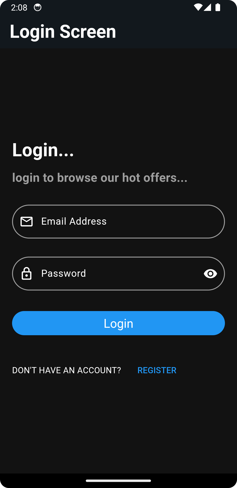
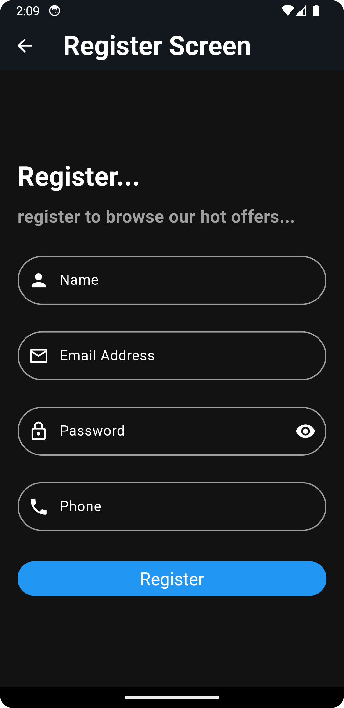
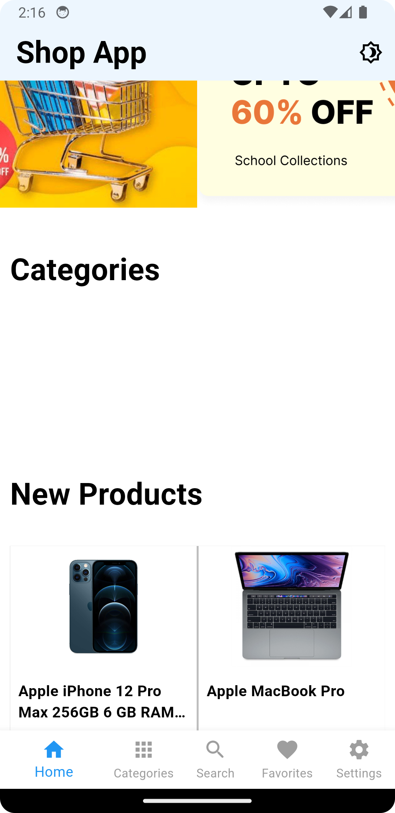
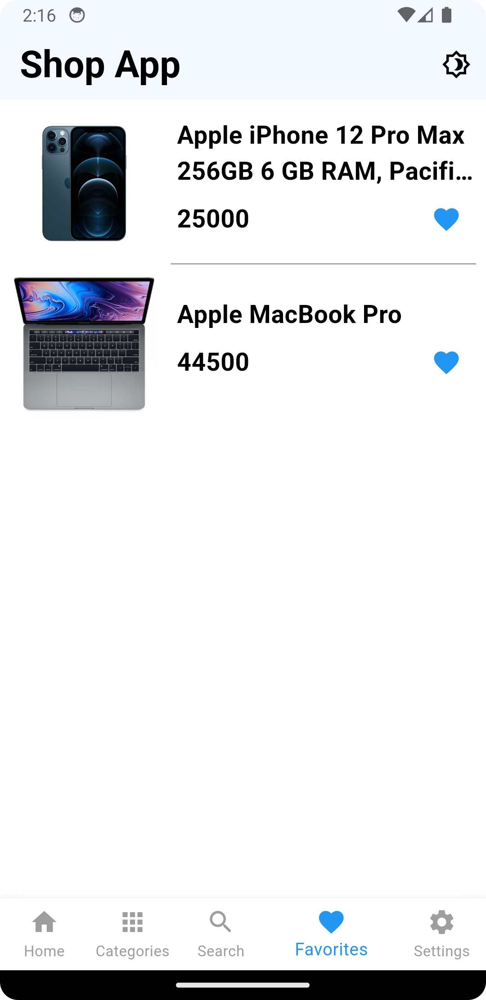
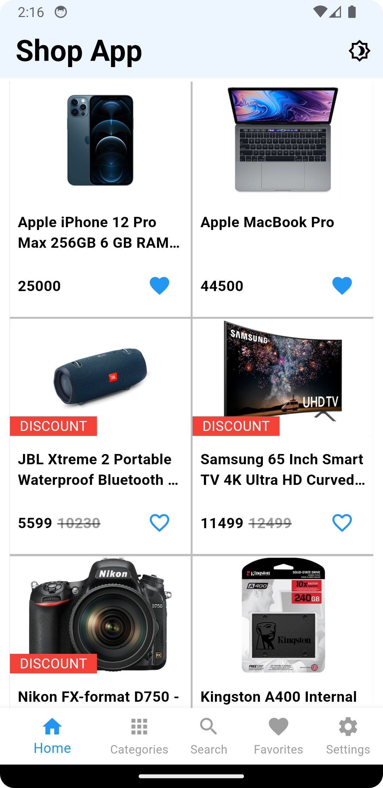

# Shop App Flutter

**Shop App Flutter** is a modern and intuitive e-commerce application built using **Flutter** and **Firebase**. The app provides users with a smooth and responsive shopping experience, allowing them to browse through products, add them to their cart, and make purchases. The app is designed to offer real-time updates, making it an ideal solution for online shopping.

## Project Description

This mobile application was developed to solve the need for a flexible, cross-platform e-commerce solution. It allows users to:

- Browse products available for sale
- Register and log in using Firebase Authentication
- Add items to their shopping cart
- Proceed to checkout and view order summaries

By leveraging **Flutter** for the user interface and **Firebase** for backend services, the app provides an efficient and scalable solution for modern online retail businesses.

### Key Highlights:
- **Cross-Platform**: Works seamlessly on both Android and iOS devices.
- **Real-Time Data**: Product listings, user carts, and order statuses are updated in real-time via Firebase Firestore.
- **Secure Authentication**: Firebase Authentication ensures secure user logins and registrations.

## Features

- **User Authentication**: Users can sign up and log in using Firebase Authentication.
- **Product Browsing**: Browse a catalog of products, with images, descriptions, and prices.
- **Add to Cart**: Users can add selected products to their cart and view them before checkout.
- **Real-Time Updates**: Product availability and user cart statuses are updated in real-time via Firebase Firestore.
- **Responsive Design**: Optimized for both Android and iOS devices, providing a smooth user experience on any screen size.

## Technologies Used

- **Flutter**: Framework for building the app's user interface and business logic.
- **Firebase**: Backend services for authentication, database (Firestore), and storage.
- **Dart**: Programming language used to build the app.

## Skills Used

- **Flutter**: Framework for building the app's UI and managing business logic.
- **Firebase**: Backend services for user authentication and data storage.
- **Dart**: Programming language for building the app.
- **Git/GitHub**: Version control and project management.
- **Responsive Design**: Ensuring a smooth experience across various screen sizes.
- **Real-Time Data**: Firebase Firestore for real-time product and cart updates.

## Installation

Follow these steps to run the project locally:

### Prerequisites
- Install [Flutter](https://flutter.dev/docs/get-started/install).
- Install [Android Studio](https://developer.android.com/studio) or your preferred IDE (Visual Studio Code is recommended).
- Set up Firebase and create a Firebase project.

### Steps to run the app:

1. Clone the repository:

    ```bash
    git clone https://github.com/kirlousHelal/shop_app_flutter.git
    ```

2. Navigate into the project directory:

    ```bash
    cd shop_app_flutter
    ```

3. Install dependencies:

    ```bash
    flutter pub get
    ```

4. Set up Firebase:
    - Create a Firebase project and enable Firebase Authentication and Firestore.
    - Follow the [official documentation](https://firebase.flutter.dev/docs/overview) for adding Firebase to your Flutter project.

5. Run the app:

    ```bash
    flutter run
    ```

## Screenshots

Here are some screenshots of the app to showcase its interface and features:

|             Login Page             |             Register Page             |             Home Page             |
| :-----------------------------------: | :-----------------------------------: | :----------------------------------: |
|  |  |  |

|             Favorites Page             |             Home List Products Page             |                          |
| :------------------------------------: | :---------------------------------: | :----------------------------------: |
|  |  |  |
<!-- | <div style="text-align: center;">
    
    <p style="margin-top: 10px;"><strong>Login Page</strong></p>
</div> | <div style="text-align: center;">
    
    <p style="margin-top: 10px;"><strong>Register Page</strong></p>
</div> | <div style="text-align: center;">
    
    <p style="margin-top: 10px;"><strong>Home Page</strong></p>
</div> |
| --- | --- | --- |
| <div style="text-align: center;">
    
    <p style="margin-top: 10px;"><strong>Favorites Page</strong></p>
</div> | <div style="text-align: center;">
    
    <p style="margin-top: 10px;"><strong>Home List Products Page</strong></p>
</div> | |
-->

*(Replace the placeholder links with actual paths to your images. If you want to use screenshots from your local device, you can upload them to your GitHub repository and link to them, or use an image hosting service.)*

## Contributing

1. Fork the repository.
2. Create a new branch (`git checkout -b feature-branch`).
3. Commit your changes (`git commit -am 'Add new feature'`).
4. Push to the branch (`git push origin feature-branch`).
5. Create a new Pull Request.

## License

This project is licensed under the MIT License - see the [LICENSE](LICENSE) file for details.
